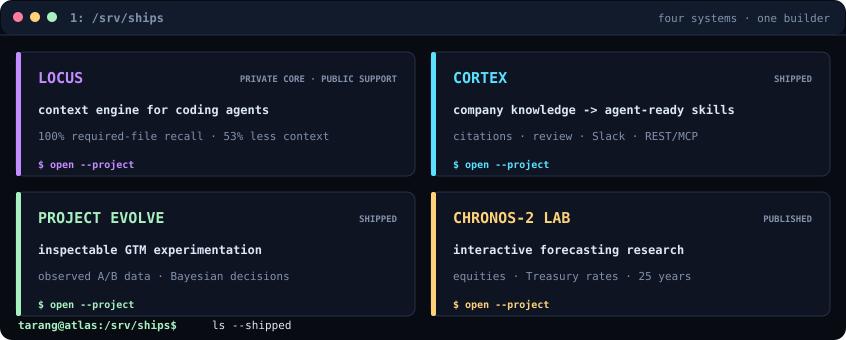

<a id="top"></a>

<p align="center">
  <picture>
    <source media="(max-width: 620px)" srcset="assets/hero-phone.svg">
    <source media="(prefers-color-scheme: light)" srcset="assets/hero-light.svg">
    
  </picture>
</p>

<p align="center">
  <a href="https://tarang-portfolio-pink.vercel.app"></a>
  <a href="https://github.com/taranggoyal70/locus-support"></a>
  <a href="https://linkedin.com/in/tarang-goyal"></a>
  <a href="https://arxiv.org/abs/2605.21504"></a>
  <a href="mailto:taranggoyal2000@gmail.com"></a>
</p>

<a id="ships"></a>

<p>
  <picture>
    <source media="(max-width: 620px)" srcset="assets/projects-phone.svg">
    <source media="(prefers-color-scheme: light)" srcset="assets/projects-light.svg">
    
  </picture>
</p>

<p align="center">
  <a href="https://github.com/taranggoyal70/locus-support"><b>Locus</b></a> ·
  <a href="https://github.com/taranggoyal70/Cortex"><b>Cortex</b></a> ·
  <a href="https://github.com/taranggoyal70/Schole-AI-challenge"><b>Project EVOLVE</b></a> ·
  <a href="https://timeseries-fm-web.vercel.app"><b>Chronos-2 Lab</b></a>
</p>

<a id="proof"></a>

<p>
  <picture>
    <source media="(max-width: 620px)" srcset="assets/proof-phone.svg">
    <source media="(prefers-color-scheme: light)" srcset="assets/proof-light.svg">
    
  </picture>
</p>

```text
tarang@locus:~$ cat /etc/builder.conf

product     = rough idea -> working system -> real user feedback
languages   = TypeScript, Python, SQL
systems     = AI agents, MCP, RAG, APIs, full-stack products
tools       = React, Next.js, FastAPI, PostgreSQL, Supabase, AWS, Vercel
standard    = own the product, test the edges, ship the whole thing
currently   = making coding agents spend their context on the right files
```

<details>
<summary><code>tarang@locus:~$ man tarang</code></summary>

```text
NAME
    tarang - AI product engineer who likes ambiguous problems

SYNOPSIS
    tarang [idea] --build-end-to-end --talk-to-users --measure

DESCRIPTION
    Builds agentic products across the model, backend, frontend,
    integrations, deployment, and evaluation layers.

NOTES
    8x hackathon and competition winner.
    Published research on multivariate forecasting with foundation models.
    Sleep is available as an optional dependency.
```

</details>

<p align="center"><sub>Generated from <a href="scripts/render_profile.py">one dependency-free Python renderer</a>. The console refreshes weekly through GitHub Actions.</sub></p>

