<a id="top"></a>

<p align="center">
  <picture>
    <source media="(max-width: 620px)" srcset="assets/hero-phone.svg">
    <source media="(prefers-color-scheme: light)" srcset="assets/hero-light.svg">
    
  </picture>
</p>

<a id="routes"></a>

<picture>
  <source media="(prefers-color-scheme: light)" srcset="assets/sections/routes-light.svg">
  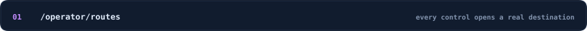
</picture>

<p align="center">
  <a href="https://tarang-portfolio-pink.vercel.app"><picture><source media="(prefers-color-scheme: light)" srcset="assets/keys/portfolio-light.svg">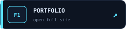</picture></a>
  <a href="https://github.com/taranggoyal70?tab=repositories"><picture><source media="(prefers-color-scheme: light)" srcset="assets/keys/github-light.svg">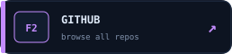</picture></a>
  <a href="#ships"><picture><source media="(prefers-color-scheme: light)" srcset="assets/keys/ships-light.svg">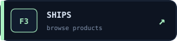</picture></a>
</p>

<p align="center">
  <a href="https://arxiv.org/abs/2605.21504"><picture><source media="(prefers-color-scheme: light)" srcset="assets/keys/paper-light.svg">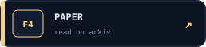</picture></a>
  <a href="https://linkedin.com/in/tarang-goyal"><picture><source media="(prefers-color-scheme: light)" srcset="assets/keys/linkedin-light.svg">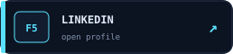</picture></a>
  <a href="mailto:taranggoyal2000@gmail.com"><picture><source media="(prefers-color-scheme: light)" srcset="assets/keys/email-light.svg">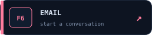</picture></a>
</p>

<a id="ships"></a>

<picture>
  <source media="(prefers-color-scheme: light)" srcset="assets/sections/ships-light.svg">
  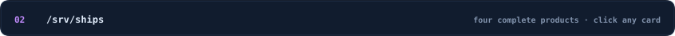
</picture>

<a href="https://github.com/taranggoyal70/locus-support">
  <picture><source media="(prefers-color-scheme: light)" srcset="assets/ships/locus-light.svg">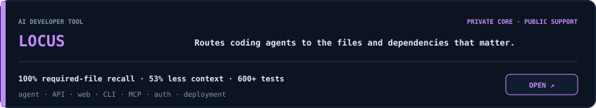</picture>
</a>

<a href="https://github.com/taranggoyal70/Cortex">
  <picture><source media="(prefers-color-scheme: light)" srcset="assets/ships/cortex-light.svg">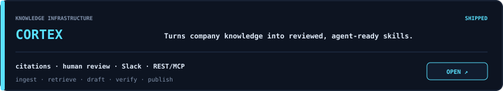</picture>
</a>

<a href="https://github.com/taranggoyal70/Schole-AI-challenge">
  <picture><source media="(prefers-color-scheme: light)" srcset="assets/ships/evolve-light.svg">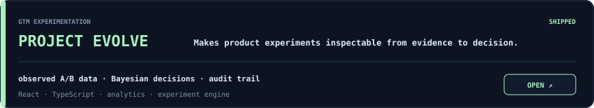</picture>
</a>

<a href="https://timeseries-fm-web.vercel.app">
  <picture><source media="(prefers-color-scheme: light)" srcset="assets/ships/chronos-light.svg">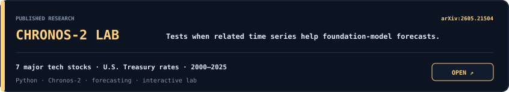</picture>
</a>

<a id="proof"></a>

<picture>
  <source media="(prefers-color-scheme: light)" srcset="assets/sections/proof-light.svg">
  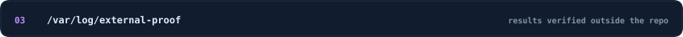
</picture>

<picture>
  <source media="(prefers-color-scheme: light)" srcset="assets/proof-light.svg">
  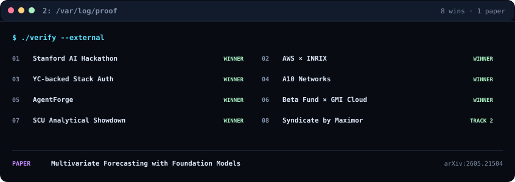
</picture>

<p align="center">
  <a href="https://arxiv.org/abs/2605.21504"><code>READ THE PAPER ↗</code></a>
  &nbsp;&nbsp;·&nbsp;&nbsp;
  <a href="https://tarang-portfolio-pink.vercel.app"><code>OPEN FULL PORTFOLIO ↗</code></a>
</p>

<a id="operator"></a>

<picture>
  <source media="(prefers-color-scheme: light)" srcset="assets/sections/operator-light.svg">
  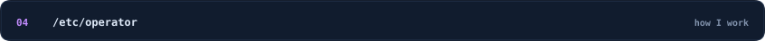
</picture>

```text
tarang@builder:~$ cat /etc/operator.conf

product     = rough idea -> working system -> real user feedback
languages   = TypeScript, Python, SQL
systems     = AI agents, MCP, RAG, APIs, full-stack products
tools       = React, Next.js, FastAPI, PostgreSQL, Supabase, AWS, Vercel
standard    = own the product, test the edges, ship the whole thing
currently   = building useful AI products from rough idea to production
```

<details>
<summary><code>tarang@builder:~$ man tarang</code></summary>

```text
NAME
    tarang - AI product engineer who likes ambiguous problems

SYNOPSIS
    tarang [idea] --build-end-to-end --talk-to-users --measure

DESCRIPTION
    Builds agentic products across the model, backend, frontend,
    integrations, deployment, and evaluation layers.

NOTES
    8x hackathon and competition winner.
    Published research on multivariate forecasting with foundation models.
    Sleep is available as an optional dependency.
```

</details>

<p align="center">
  <a href="#top"><code>↑ REATTACH TO TOP</code></a>
</p>

<p align="center"><sub>Rendered from <a href="scripts/render_profile.py">one dependency-free Python system</a> and refreshed by GitHub Actions.</sub></p>
